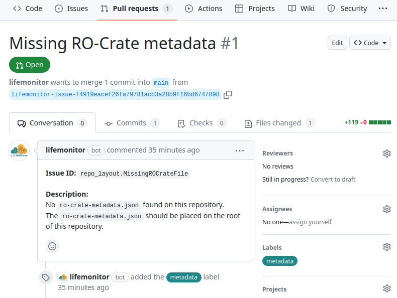
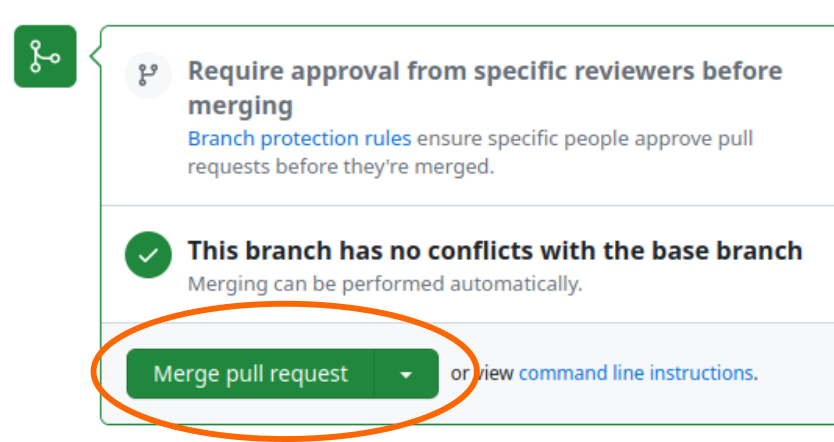
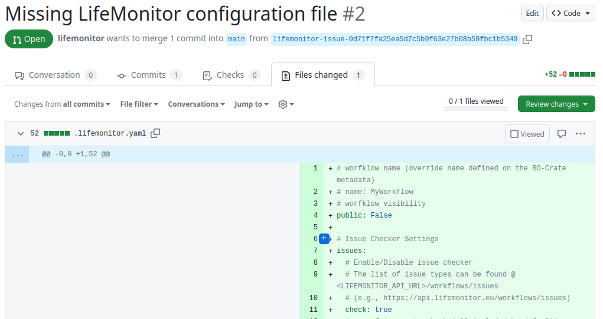
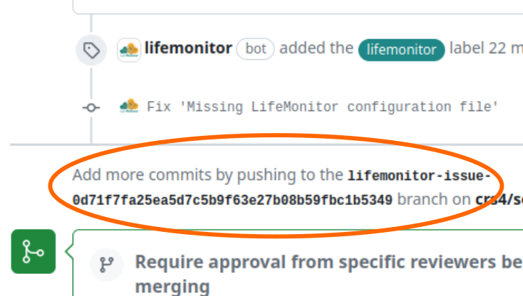
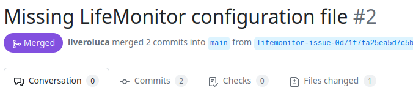

# Submitting workflows to LifeMonitor

[LifeMonitor](https://www.lifemonitor.eu/) (LM) is a service to support the
sustainability and reusability of published computational workflows. The
LifeMonitor helps alleviate the burden of maintaining workflows over time
through **automation**.

This document will show you **how to use the
[LifeMonitor](https://www.lifemonitor.eu/) service and its [GitHub
app](https://github.com/apps/lifemonitor)** on a workflow in a GitHub
repository.

## Why use the LifeMonitor?

Keeping workflows reusable takes work! Like all software, even the best
workflows can break over time if left unmaintained: for instance, there could be
a regression or an API change in an unpinned dependency, or an external resource
that the workflow relies upon might be moved to a different URL. Periodic
automated **testing** is a fundamental practice that helps expose such problems,
giving workflow maintainers a chance to intervene and fix them.  The
[LifeMonitor](https://www.lifemonitor.eu/) helps you monitor and periodically
execute the automated tests for your workflow.

Moreover, workflows should be findable to be reusable.
[LifeMonitor](https://www.lifemonitor.eu/) helps automate the generation of
[RO-Crate metadata](https://www.lifemonitor.eu/workflow_testing_ro_crate) as
well as registering new releases of your workflow with the
[WorkflowHub](https://workflowhub.eu).

Finally, [LifeMonitor](https://www.lifemonitor.eu/) can apply automated checks
to your workflow repository to help you follow [community best
practices](https://by-covid.github.io/gtn/galaxy-best-practices).

## Pre-conditions

We assume you **published a Galaxy workflow** to a GitHub repository following the
[*Galaxy Community best
practices*](../galaxy-best-practices#community-best-practices).

In addition, we assume you have followed the same best practices to [**create
tests** for your
workflow](../galaxy-best-practices#generating-tests-for-your-workflow) using
[Planemo](https://planemo.readthedocs.io/en/latest/best_practices_workflows.html#tests),
as well as configuring a [GitHub Actions
workflow](../galaxy-best-practices#adding-a-github-workflow) to automatically
run those tests.  Don't worry if this sounds like a lot: the [best
practices*](../galaxy-best-practices) document provides straightforward
instructions.

### Running example

As a running example, we're going to use a simple "sort and change case"
workflow: it merely takes a text file, sorts the lines and swaps the case of
all the letters.  You can access and inspect this example workflow, its tests
and its GitHub Action through
:warning: **UPDATE THIS LINK** [this link](https://github.com/ilveroluca/gtn/tree/main/docs/submitting-life-monitor/planemo_test_setup).

## Installing the LM GitHub App

The [LM GitHub App](https://github.com/apps/lifemonitor) provides the most
straightforward way to use LM with your GitHub-hosted workflow. The app can do
the following things. 

* Examine your repository and apply a series of automated *checks*.
* Suggest pull requests (PRs) to make changes or additions to bring the workflow
  repository closer to conforming to best practices.
* Open issues to let you know about problems detected by the checks:
  * in some cases, you can interact with the LifeMonitor bot through the issues,
      to provide information or issue commands.
* Register new releases/versions of the workflow with both the [LifeMonitor
  service](https://app.lifemonitor.eu/) (for test monitoring) and the
  [WorkflowHub](https://workflowhub.eu/) workflow registry.

Follow the instructions provided by the [LifeMonitor
documentation](https://www.lifemonitor.eu/lm_wft_best_practices_github_app#installation)
to complete the app installation on your repository, and:

* we recommend that you enable the LifeMonitor "Issue Checks";
* we also recommend that you enable the automatic upload to the
    [WorkflowHub](https://workflowhub.eu/).

:bulb: Note that completing the installation steps may require you to create an
account with both LifeMonitor and WorkflowHub.  We recommend **using [LS
Login](https://lifescience-ri.eu/ls-login/)** to authenticate with both
services.

:bulb: You will also need to connect your GitHub account to your LifeMonitor
account.

## LifeMonitor Checks

Once the LM app is installed, it starts working for you by running its automated
checks. The checks generally report one problem at a time, by opening an issue
or opening a PR with a suggested fix.  In the following subsections we'll show
the sequence of PR's and issues that are opened in our Sort and Change Case
workflow repository.

### RO-Crate metadata

LM might notice that we don't have an RO-Crate:

The LM app **automatically** executes
[repo2crate](https://github.com/crs4/repo2rocrate) as recommended by [best
practices](../galaxy-best-practices#best-practice-repositories-and-ro-crate) and
opens a pull request to propose the resulting RO-Crate for integration in our
repository.  Review the RO-Crate and integrate additional metadata or correct
it as necessary. Finally, merge the into your repository.  LifeMonitor with
automatically delete the PR branch once merged, to keep your repository tidy.

### LifeMonitor configuration file

Next, LM suggests that we add a [LifeMonitor configuration
file](https://www.lifemonitor.eu/lm_wft_best_practices_github_app#configuration-file)
to our repository.  Through this file in YAML format, we can customize some aspects of
LifeMonitor's behavior and provide it with additional metadata.

This time, we're going to make some changes to the default configuration before
accepting it.  The PR's "Conversation" tab on GitHub tells us to push changes to
a specific branch to make changes to the file:

So we'll go to the local copy of our workflow repository, fetch the remote and
checkout this branch:

    $ cd sort-and-change-case-workflow
    $ git fetch origin
    $ git checkout lifemonitor-issue-0d71f7fa25ea5d7c5b9f63e27b08b59fbc1b5349
    Branch 'lifemonitor-issue-0d71f7fa25ea5d7c5b9f63e27b08b59fbc1b5349' set up to track remote branch 'lifemonitor-issue-0d71f7fa25ea5d7c5b9f63e27b08b59fbc1b5349' from 'origin'.
    Switched to a new branch 'lifemonitor-issue-0d71f7fa25ea5d7c5b9f63e27b08b59fbc1b5349'

Now we can edit the file locally with our favorite text editor:

    $ vim .lifemonitor.yaml

We're going to set the workflow name and make it public (which means that anyone
will be able to see it on LifeMonitor):

    name: "Sort and change case"
    public: true

We're also going to enable automatic registration of workflow releases in
WorkflowHub and LifeMonitor.  We're going to edit the configuration so that:

1. workflow tag names that follow the [Semantic Versioning](https://semver.org/)
   convention are recognized as releases;
2. the WorkflowHub record is updated for each new release

    push:
      tags:
        - name: "*.*.*"  #  pattern to identify a release tag
          update_registries: ["wfhub"]  # Registry to be updated. "wfhub" == WorkflowHub

If you're just testing things, avoid dirtying your WorkflowHub collection.
Instead, point the LM app to the development instance of WorkflowHub by
specifying:

    
          update_registries: ["wfhubdev"]  # Registry to be updated. "wfhubdev" == WorkflowHub dev

:warning: To have your workflow's WorkflowHub entry automatically updated, you
**must** connect your WorkflowHub (or def.WorkflowHub) account to LifeMonitor.
Check you [LifeMonitor account
profile](https://app.lifemonitor.eu/api/account/profile): if the buttons shown
in the image below say "**connected**", you're ok; else, click on the
appropriate "**connect** button and log into the WorkflowHub with the account
you'd like LifeMonitor to use.

The LifeMonitor documentation has [a more detailed explanation](https://www.lifemonitor.eu/faq#which-external-accounts-are-linked-with-my-lifemonitor-account).

Commit your changes now and push them to the repository:

    $ git commit -a -m "Update LifeMonitor settings"
    [lifemonitor-issue-0d71f7fa25ea5d7c5b9f63e27b08b59fbc1b5349 0924ad7] Update LifeMonitor settings
     1 file changed, 22 insertions(+), 52 deletions(-)
     rewrite .lifemonitor.yaml (63%)
    $ git push origin

Now you can go back to the Pull Request and merge it.

