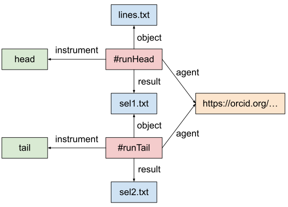

# Workflow Run RO-Crate

The [Workflow Run RO-Crate](https://www.researchobject.org/workflow-run-crate/) working group is developing a series of [RO-Crate profiles](https://www.researchobject.org/ro-crate/profiles.html) for representing the provenance of computational workflow executions. The set includes three profiles, which represent provenance with increasing level of detail:

* [Process Run Crate](https://w3id.org/ro/wfrun/process) can be used to describe the execution of one or more tools that contribute to a generic computation;
* [Workflow Run Crate](https://w3id.org/ro/wfrun/workflow) also describes computational processes, but in this case the execution is supposed to be orchestrated by a computational workflow (e.g., a Galaxy workflow);
* [Provenance Run Crate](https://w3id.org/ro/wfrun/provenance) is based on Workflow Run Crate, but provides additional specifications for describing the details of each step's execution.


## Process Run Crate

Consider a simple computation where we select the first four lines of a text file, and then we select the last three lines out of the initial selection. Suppose we start with the following input file, `lines.txt`:

```
one
two
three
four
five
```

Then we run:

```
head --lines 4 lines.txt >sel1.txt
```

The `sel1.txt` file will then be:

```
one
two
three
four
```

Now we run:

```
tail --lines 3 sel1.txt >sel2.txt
```

Obtaining the following `sel2.txt`:

```
two
three
four
```

A Process Run Crate that describes the above computation will contain the three text files, plus an `ro-crate-metadata.json` file structured as follows:

```json
{
    "@context": "https://w3id.org/ro/crate/1.1/context",
    "@graph": [
        {
            "@id": "ro-crate-metadata.json",
            "@type": "CreativeWork",
            "conformsTo": {"@id": "https://w3id.org/ro/crate/1.1"},
            "about": {"@id": "./"}
        },
        {
            "@id": "./",
            "@type": "Dataset",
            "conformsTo": {"@id": "https://w3id.org/ro/wfrun/process/0.1"},
            "hasPart": [
                {"@id": "lines.txt"},
                {"@id": "sel1.txt"},
                {"@id": "sel2.txt"}
            ],
            "mentions": [
                {"@id": "#runHead"},
                {"@id": "#runTail"}
            ]
        },
        {   "@id": "https://w3id.org/ro/wfrun/process/0.1",
            "@type": "CreativeWork",
            "name": "Process Run Crate",
            "version": "0.1"
        },
        {
            "@id": "https://www.gnu.org/software/coreutils/head",
            "@type": "SoftwareApplication",
            "name": "head",
            "softwareVersion": "8.30"
        },
        {
            "@id": "https://www.gnu.org/software/coreutils/tail",
            "@type": "SoftwareApplication",
            "name": "tail",
            "softwareVersion": "8.30"
        },
        {
            "@id": "#runHead",
            "@type": "CreateAction",
            "name": "Select first four lines",
            "description": "head --lines 4 lines.txt >sel1.txt",
            "endTime": "2023-04-27T15:02:56+02:00",
            "instrument": {"@id": "https://www.gnu.org/software/coreutils/head"},
            "object": {"@id": "lines.txt"},
            "result": {"@id": "sel1.txt"},
            "agent": {"@id": "https://orcid.org/0000-0002-1825-0097"}
        },
        {
            "@id": "#runTail",
            "@type": "CreateAction",
            "name": "Select first four lines",
            "description": "tail --lines 3 sel1.txt >sel2.txt",
            "endTime": "2023-04-27T15:04:02+02:00",
            "instrument": {"@id": "https://www.gnu.org/software/coreutils/tail"},
            "object": {"@id": "sel1.txt"},
            "result": {"@id": "sel2.txt"},
            "agent": {"@id": "https://orcid.org/0000-0002-1825-0097"}
        },
        {
            "@id": "lines.txt",
            "@type": "File"
        },
        {
            "@id": "sel1.txt",
            "@type": "File"
        },
        {
            "@id": "sel2.txt",
            "@type": "File"
        },
        {
            "@id": "https://orcid.org/0000-0002-1825-0097",
            "@type": "Person",
            "name": "Josiah Carberry"
        }
    ]
}
```

The RO-Crate describes two actions, `#runHead` and `#runTail`, which represent, respectively, the execution of the `head` and `tail` programs, referenced via the `instrument` property. Each action references its input(s) via `object` and its output(s) via `result`. Note how the two actions are connected by the fact that the output of `#runHead` is the input of `#runTail`: they form an "implicit workflow", whose steps have been executed manually rather than by a higher level software tool. The actions also refer to their executor via the `agent` property. The following diagram shows the relationships between the various entities:



For more information, you can see the [Process Run Crate](https://w3id.org/ro/wfrun/process) profile, which contains the full specification.


## Workflow Run Crate

The [Workflow Run Crate](https://w3id.org/ro/wfrun/workflow) profile follow the same basic principles, but it's meant for the description of computations where the executions of the various steps are orchestrated by an automated workflow. An example of RO-Crate following this profile is available at [https://doi.org/10.5281/zenodo.7785860](https://doi.org/10.5281/zenodo.7785860). One of the main additions with respect to Process Run Crate is the representation of parameter "slots" (which can take different values according to the specific run) via `FormalParameter`:

```json
{
    "@id": "#num_lines_param-param",
    "@type": "FormalParameter",
    "additionalType": "Integer",
    "description": "number of lines to select",
    "name": "num_lines_param",
    "valueRequired": "True"
}
```


## Provenance Run Crate

[Provenance Run Crate](https://w3id.org/ro/wfrun/provenance) takes the modeling one step further, specifying how to represent the actions corresponding to individual steps in the workflow. An example of such an RO-Crate is at [https://doi.org/10.5281/zenodo.7669622](https://doi.org/10.5281/zenodo.7669622).
